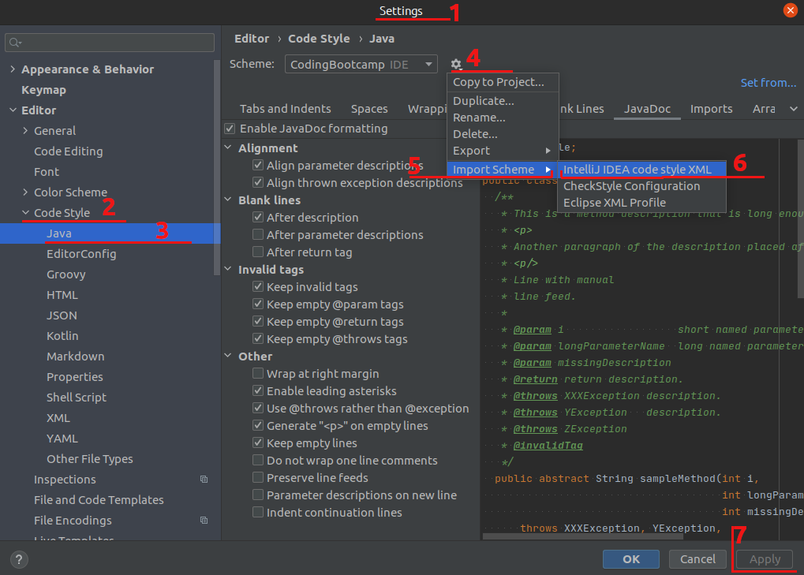

# Zeus the Mighty

## Features

- Testing students solutions with jUnit
- Checking a style of code with Checkstyle
- Packaging students projects into .jar archive

## Importantly

- Zeus jar archive should be in the root folder of the student's project

## How to use

Launch the command line from the root folder of your project and input the code below

##### run Zeus only

`java -cp "Zeus-1.0.jar" com.kovalevskyi.academy.zeus.TheMighty <parameters>`

##### run Zeus with a student's jar archive

###### Unix-like

`java -cp "CodingBootcamp-1.0.jar:Zeus-1.0.jar" com.kovalevskyi.academy.zeus.TheMighty <parameters>`

###### Windows

`java -cp "CodingBootcamp-1.0.jar;Zeus-1.0.jar" com.kovalevskyi.academy.zeus.TheMighty <parameters>`

**If your CodingBootcamp-1.0.jar location is different, you should write a path to this file from the
project root.*

## Available parameters

|Short|Full|Description|
|---|---|---|
|`-a`|`--all`|Run all tests|
|`-b`|`--build`|Build jar|
|`-c`|`--checkstyle`|Run checkstyle for week/day. Cannot be applied to `*.jar` files!|
|`-d`|`--day=<day>`|Number of the day|
|`-e`|`--error`|JUnit error mode (only error prints)|
|`-h`|`--help`|Show help message|
|`-m`|`--maven=<mavenHome>`|Set a path to the maven home|
|`-s`|`--show`|Show tests' path for week/day|
|`-t`|`--test=<test>`|Specific test to executed according path to week/day|
|`-V`|`--version`|Print version information|
|`-w`|`--week=<week>`|Number of the week|

## Examples of usage

**If your CodingBootcamp-1.0.jar location is different, you should write a path to this file from the
project root.*

Build jar archive

`java -cp "Zeus-1.0.jar" Zeus -b`

Check a style of code for week 0 day 1

`java -cp "Zeus-1.0.jar" Zeus -c -w0 -d1`

Test for week 0 day 1

`java -cp "target/CodingBootcamp-1.0.jar:Zeus-1.0.jar" com.kovalevskyi.academy.zeus.TheMighty -w0 -d1`

Test for week 0 day 1 with no prints (only error prints)

`java -cp "target/CodingBootcamp-1.0.jar:Zeus-1.0.jar" com.kovalevskyi.academy.zeus.TheMighty -e -w0 -d1`

# To contributors:
0. Examples of dev usage:

`<NAME>` = `CodingBootcamp-1.0-SNAPSHOT` or `CodingBootcamp-1.0-SNAPSHOT-tests-only`.

Test for week 0 day 1

`java -cp "target/<NAME>.jar:Zeus-1.0.jar" com.kovalevskyi.academy.zeus.TheMighty -w0 -d1`

Test for week 0 day 1 with no prints (only error prints)

`java -cp "target/<NAME>.jar:Zeus-1.0.jar" com.kovalevskyi.academy.zeus.TheMighty -e -w0 -d1`

1. Do not forget make a separate branch for your fixes.
2. Use the [intellij-java-google-style.xml](https://github.com/google/styleguide/blob/gh-pages/intellij-java-google-style.xml)
   
   How to apply "intellij-java-google-style.xml" fo current project:
   
3. Remember - tests should be speaking.
